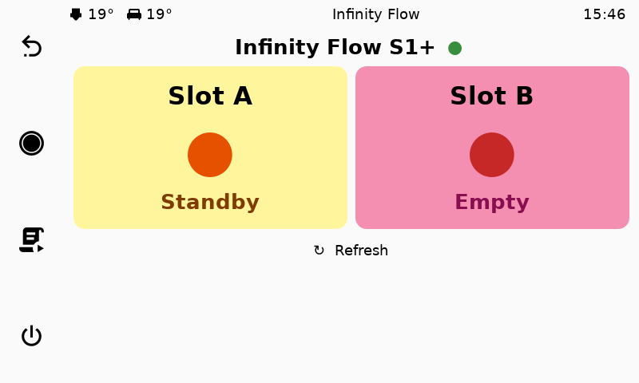

# KlipperScreen UI Redesign Report
## Infinity Flow S1+ Integration — Analysis & Recommendations

**Date:** 2026-03-29
**Device:** IdeaFormer IR3 V2 (belt printer)
**Screen:** 800×480 HDMI touchscreen
**KlipperScreen version:** 2.0.1-3-ge148cc69
**Theme:** material-light (pastel: yellow/pink/green/cyan)

---

## 1. UI Level Analysis

KlipperScreen organizes its UI in three levels:

### Level 0 — Printer Dashboard (home)
The default view after connecting. Shows:
- Left panel: temperature readings + chart (live)
- Right panel: 3×2 grid of quick-action buttons (Auto Leveling, Homing, Extrude, More, Configuration, Print)
- Sidebar: back, home, filament, power icons

**Observations:**
- This is the most-viewed screen during a print
- Quick-action grid has 6 slots; the bottom row (slot 5–6) is less crowded
- Material-light colors: yellow (#FFF59D), pink (#F48FB1), green (#C5E1A5), cyan (#80DEEA)

### Level 1 — Main Menu (`__main`)
Accessed by tapping the home icon. Shows all configured top-level menu entries as a 4-column icon grid. Each entry is a large colored card with icon + label.

**Observations:**
- This is effectively the "app drawer" — users reach panels from here
- 4 columns fit 4 items per row; a 5th item wraps to a new row
- Default items: Move, Temperature, Disable Motors, Fan, Leds, Console
- Infinity Flow appears at the bottom of the grid after the default items

### Level 2 — More Submenu (`__main More`)
Overflow panel for less-used items. Required an extra tap.

**Problem found:** The original Infinity Flow widget was buried here, requiring 2 taps from the printer dashboard. This made it effectively invisible during printing.

### Level 3 — Panel pages
Full-screen panels like `infinity_flow`, `move`, `temperature`, `print`, etc.

---

## 2. Original Problems

| Problem | Impact |
|---|---|
| Widget buried in `More` submenu | 2 extra taps from dashboard; never seen during prints |
| Panel used QR code widget | Huge unused space, unreadable on 800×480 touchscreen |
| Panel used `Gtk.STYLE_PRIORITY_APPLICATION` | Incorrect constant name, caused runtime crash |
| No auto-refresh | State went stale unless manually refreshed |
| No `deactivate()` lifecycle | Timer leak when navigating away |

---

## 3. Solution Implemented

### Menu placement
Moved Infinity Flow from `[menu __main More infinity_flow]` to `[menu __main infinity_flow]`.

The button is now visible at Level 1 (main menu), accessible with a single tap from anywhere. On the printer dashboard, it also appears as a quick-action button in the 3×2 grid (bottom-right slot), making it reachable in **zero taps** from the dashboard.

**KlipperScreen.conf entry:**
```ini
[menu __main infinity_flow]
name: Infinity Flow
icon: infinity_flow
panel: infinity_flow
```

### Panel redesign (`panel.py`)
Replaced the old layout with:

- **Two large colored `EventBox` cards** side by side — one per filament slot (A and B)
- Each card shows: slot label, large colored status dot (●), state text
- Card background changes dynamically to match state:
  - `loaded` (Ready) → green (#C5E1A5)
  - `active` (Feeding) → cyan (#80DEEA)
  - `sleep` (Standby) → yellow (#FFF59D)
  - `unloaded` (Empty) → pink (#F48FB1)
- WebSocket connection indicator (green/red dot) in the title row
- Auto-refresh every 5 seconds via `GLib.timeout_add_seconds`
- Manual Refresh button
- Proper `activate()` / `deactivate()` lifecycle (starts/stops timer)
- Thread-safe UI updates via `GLib.idle_add`
- API call via `urllib.request` to `localhost:7125/server/infinity_flow/status`

---

## 4. Screenshot



Slot A: Standby (orange dot, yellow card)
Slot B: Empty (dark red dot, pink card)
WebSocket: Connected (green dot)

---

## 5. Future Redesign Recommendations

### 5.1 Dashboard integration (high value)
Instead of requiring a tap to a separate panel, embed a compact Infinity Flow status bar directly in the **printer dashboard** sidebar. KlipperScreen supports custom sidebar icons that can show state colors.

### 5.2 Larger slot cards on widescreen
For screens larger than 800×480, the slot cards could include:
- Filament type/color label
- Estimated remaining length (if reported by S1+)
- Last-fed timestamp

### 5.3 Swap animation
When the S1+ performs an automatic swap (slot A → slot B exhausted → feeding from A), animate the transition in the UI: brief flash on the exhausted slot card, checkmark on the active slot.

### 5.4 Print status integration
Show a "Filament OK" / "Runout paused" overlay on the printer dashboard during prints, triggered by `process_update()` on `notify_infinity_flow_state_changed`.

### 5.5 Theme alignment
The material-light theme uses `#FFF59D` (yellow), `#F48FB1` (pink), `#C5E1A5` (green), `#80DEEA` (cyan). The current implementation reuses these exact color tokens for slot state cards, ensuring the widget looks native.

### 5.6 Icon
A custom SVG icon (`infinity_flow.svg`) should be added to KlipperScreen's icon set (at `~/.config/KlipperScreen/icons/` or the theme's icons folder). Currently KlipperScreen falls back to a default icon.

---

## 6. File Inventory

| File | Location | Purpose |
|---|---|---|
| `panel.py` | `klipper-infinity-flow/klipperscreen/` | KlipperScreen panel (GTK3) |
| `install.sh` | `klipper-infinity-flow/` | Deployment script |
| `KlipperScreen.conf` (on device) | `~/printer_data/config/` | Menu entry configuration |
| Screenshots | `klipper-infinity-flow/screenshots/` | UI documentation |

---

## 7. KlipperScreen Architecture Notes

- **Framework:** GTK3 via PyGObject (`gi.repository.Gtk`)
- **Panel base class:** `ks_includes.screen_panel.ScreenPanel`
- **Thread safety:** All UI updates must go through `GLib.idle_add()`; network/blocking calls go in `threading.Thread(daemon=True)`
- **CSS styling:** Use `Gtk.CssProvider` + `get_style_context().add_provider(prov, Gtk.STYLE_PROVIDER_PRIORITY_APPLICATION)` — note: NOT `STYLE_PRIORITY_APPLICATION` (wrong)
- **Dynamic updates:** Override `process_update(action, data)` to handle Moonraker WebSocket push notifications
- **Lifecycle:** Override `activate()` to start timers, `deactivate()` to stop them (prevents memory leaks)
- **Config:** Menu entries in `KlipperScreen.conf`; panels auto-discovered from `KlipperScreen/panels/` by filename
